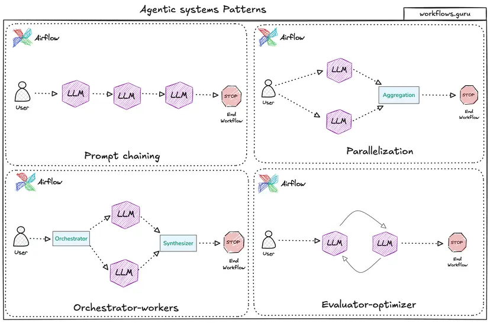

It is a fascinating paradox when engineers building the literal physical foundations of AI (the silicon chips) use workflows stuck in Level 1.

An EE PhD has a massive advantage here. They already think in terms of **deterministic systems, state machines, logic loops, and verification**. Moving from Level 1/2 (chatting/copy-pasting) to Level 3/4 (agentic loops, tool use, and autonomy) is essentially just treating the LLM as an unpredictable, high-level processing unit within a structured software/hardware system.

The demo repo you set up for him (`claude-code-for-verilog`) is the perfect bridge. It shifts the mental model from "chatting with a chatbot" to "interacting with an agent that has a file system tool belt."

Here is a roadmap of concepts, frameworks, and specific mental shifts tailored for a highly technical engineer looking to bridge that gap.

---

## 1. The Core Mental Shift: From Chat to Architecture

To move past Level 1/2, an EE expert needs to stop thinking about "prompt engineering" and start thinking about **agentic workflows**. Instead of trying to get a single massive prompt to output perfect Verilog, Level 3+ engineering breaks the problem down into loops.

*Source: [Common Agentic Workflow Design Patterns — Workflows.guru](https://www.workflows.guru/blogs/agentic-workflows-patterns)*

For an EE, the **Evaluator-Optimizer** loop is an incredibly natural fit. It mirrors how chip design works: you write code, you run a test bench (simulation), you check for errors, and you iterate.

Instead of manually running a linter or simulator on Verilog code generated by Claude, a Level 3 workflow gives Claude the *tool* to run the simulator itself, read the compiler errors, and rewrite its own code until it passes.

---

## 2. High-Yield Learning Resources

Because he is highly technical, avoid generic "How to use ChatGPT" courses. Instead, point him toward resources that focus on API orchestration, systemic design, and tool utilization.

### The Foundational Strategy (Anthropic's Research)

* **"Building Effective Agents" (Anthropic Cookbook):** This is arguably the definitive modern guide on how to move from simple prompting to agentic systems. It breaks down exactly when to use simple workflows (like chaining or parallelization) versus complex, autonomous agents. It will instantly click for an engineer.
* **The OpenAI / Anthropic API Cookbooks:** Reading through the GitHub recipe books for the major API providers shows how to handle structured JSON outputs, parallel function calling, and state management.

### Frameworks to Study (Code-as-Architecture)

To see how Level 3 and 4 systems are built programmatically, he should explore the architecture of modern agent frameworks:

* **LangGraph (by LangChain):** Exceptional for engineers because it models LLM interactions as **directed acyclic graphs (DAGs) and state machines**. A user can define explicit states, transitions, and conditional loops (e.g., "If the Verilog compilation fails, transition to the `FixCode` node; if it passes, transition to `GenerateTestbench`").
* **Microsoft AutoGen / CrewAI:** Good for exploring multi-agent orchestrator-worker patterns, where one LLM acts as the hardware architect, another writes the RTL (Register-Transfer Level) code, and a third writes the verification scripts.

---

## 3. How to Apply This to AI Chip Design & Hardware EE

If the user wants to introduce Level 3/4 capabilities to his hardware engineering workflow, he can build or leverage tools that automate the tedious parts of EDA (Electronic Design Automation).

Here are concrete project ideas he can experiment with using tools like `Claude Code` or custom Python scripts:

| Workflow Level | EE / Verilog Application | What it Looks Like |
| --- | --- | --- |
| **Level 1: Chat** | Basic QA & Review | "Explain this open-source Verilog module to me." |
| **Level 2: Copilot** | Inline Assistance | Tab-completing a standard FIFO buffer module or basic port mappings. |
| **Level 3: Agentic Loops** | Automated RTL Fixes | An agent reads a Verilog file, runs `iverilog` (a simulation tool) via CLI, catches a syntax/timing error, parses the error, fixes the source file, and repeats until compilation succeeds. |
| **Level 4: Multi-Agent RAG** | Spec-to-RTL Pipeline | Agent A parses a massive, 500-page PCIe or NVMe PDF specification document to extract timing requirements. Agent B uses those requirements to generate the Verilog. Agent C writes and executes the test bench. |

### The "Late Starter" Advantage

A high-tech company being stuck at Level 1 is incredibly common in deeply specialized fields like hardware engineering. Hardware teams are conservative by design—mistakes cost millions in tape-outs.

However, because hardware design relies heavily on formal languages, strict syntax rules, and deterministic verification tools (linters, simulators, formal verification), it is **actually the perfect sandbox for Level 3/4 automation**. The LLM can constantly test its assumptions against an absolute, deterministic truth (the simulator).

---

## Next Steps for the EE expert

If he wants a weekend project to break out of Level 1:

1. Have him install an open-source tool like **`iverilog`** or **`Verilator`** locally.
2. Use Python to write a tiny loop that passes a Verilog generation task to an LLM via API.
3. Have the script automatically run the simulator on the output, capture stdout/stderr, and feed any failures back to the LLM with a prompt saying: *"This failed compilation with the following error. Fix it."*

Seeing an LLM autonomously fix its own syntax and logic errors in a loop is the exact "aha!" moment that takes an engineer from vibe-coding to systemic automation.